## Part 1. Готовый докер

##### Взять официальный докер образ с **nginx** и выкачать его при помощи `docker pull`

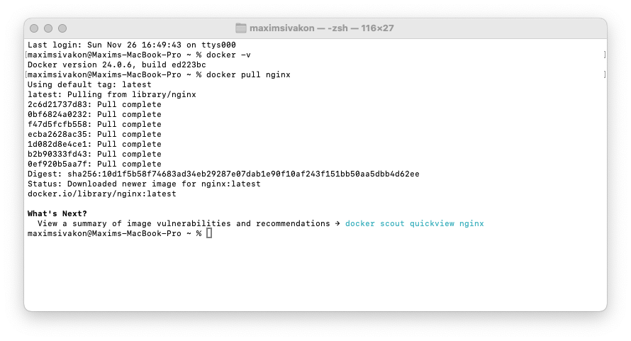

##### Проверить наличие докер образа через `docker images`

##### Запустить докер образ через `docker run -d [image_id|repository]`

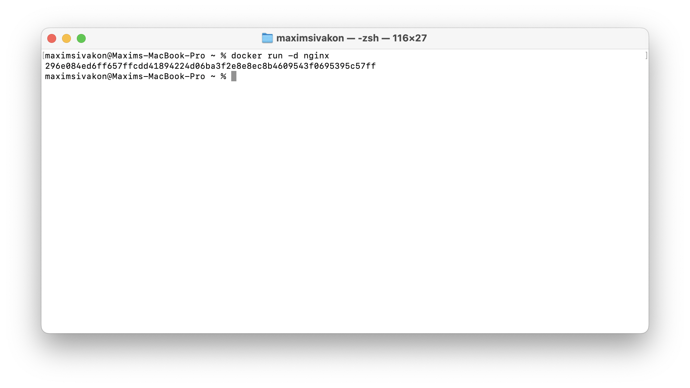

##### Проверить, что образ запустился через `docker ps`

##### Посмотреть информацию о контейнере через `docker inspect [container_id|container_name]`

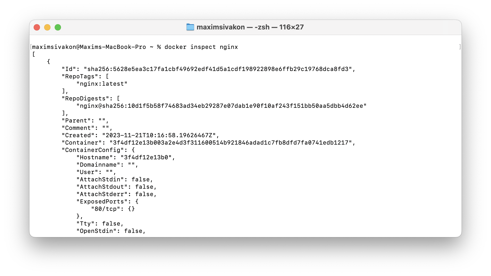

##### По выводу команды определить и поместить в отчёт размер контейнера, список замапленных портов и ip контейнера

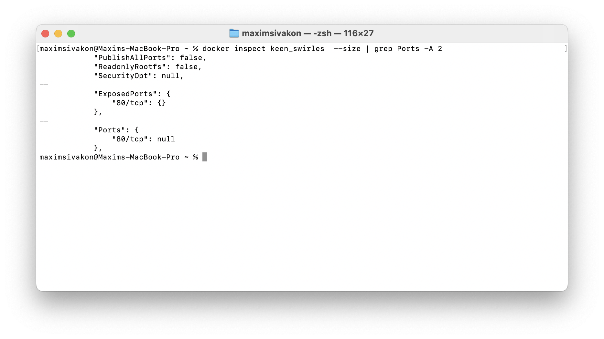
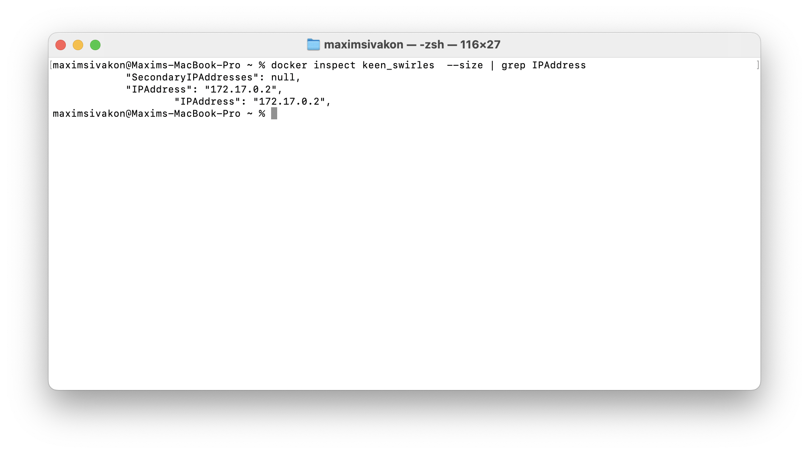

##### Остановить докер образ через `docker stop [container_id|container_name]`

##### Проверить, что образ остановился через `docker ps`

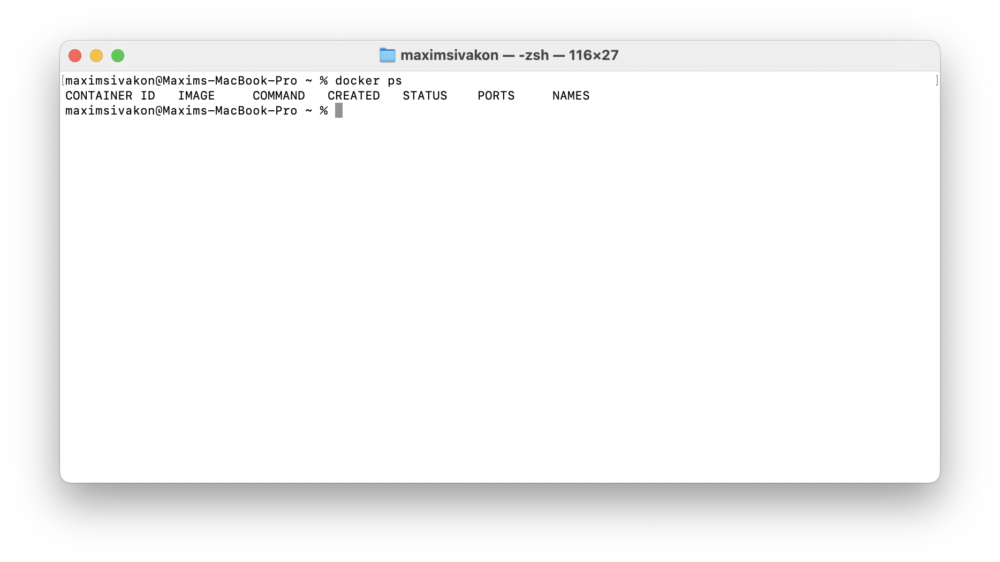

##### Запустить докер с портами 80 и 443 в контейнере, замапленными на такие же порты на локальной машине, через команду *run*

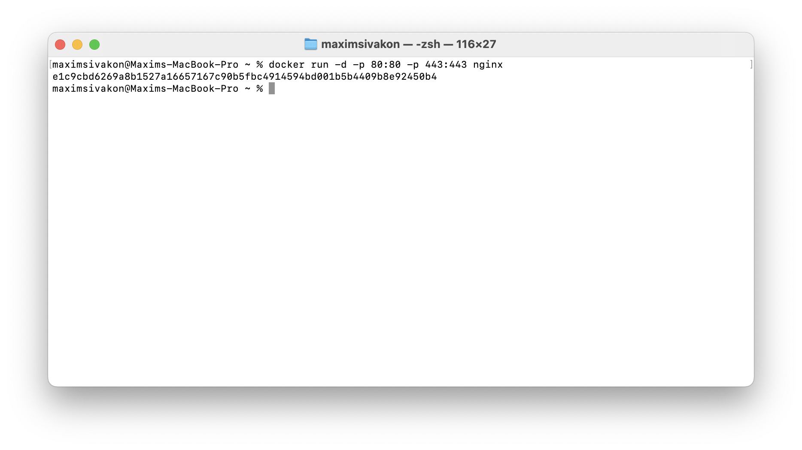

##### Проверить, что в браузере по адресу *localhost:80* доступна стартовая страница **nginx**

##### Перезапустить докер контейнер через `docker restart [container_id|container_name]`

##### Проверить любым способом, что контейнер запустился

## Part 2. Операции с контейнером

##### Прочитать конфигурационный файл *nginx.conf* внутри докер контейнера через команду *exec*

##### Создать на локальной машине файл *nginx.conf*
##### Настроить в нем по пути */status* отдачу страницы статуса сервера **nginx**

##### Скопировать созданный файл *nginx.conf* внутрь докер образа через команду `docker cp`

##### Перезапустить **nginx** внутри докер образа через команду *exec*

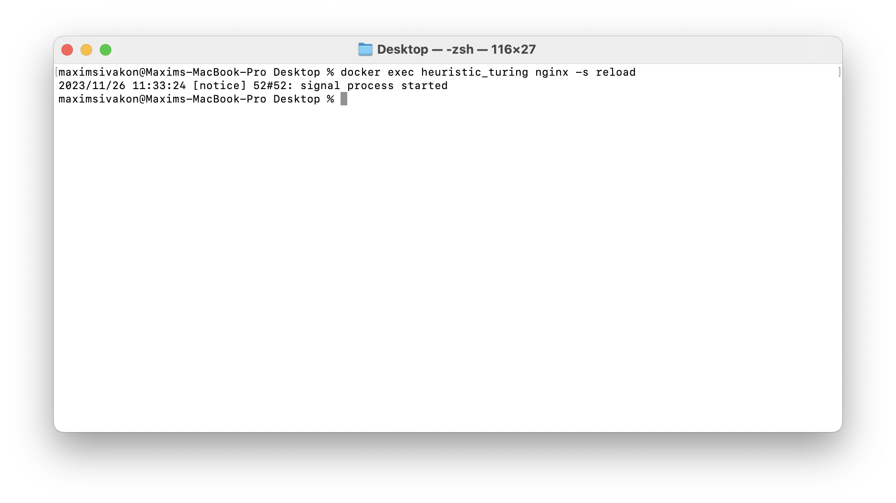

##### Проверить, что по адресу *localhost:80/status* отдается страничка со статусом сервера **nginx**

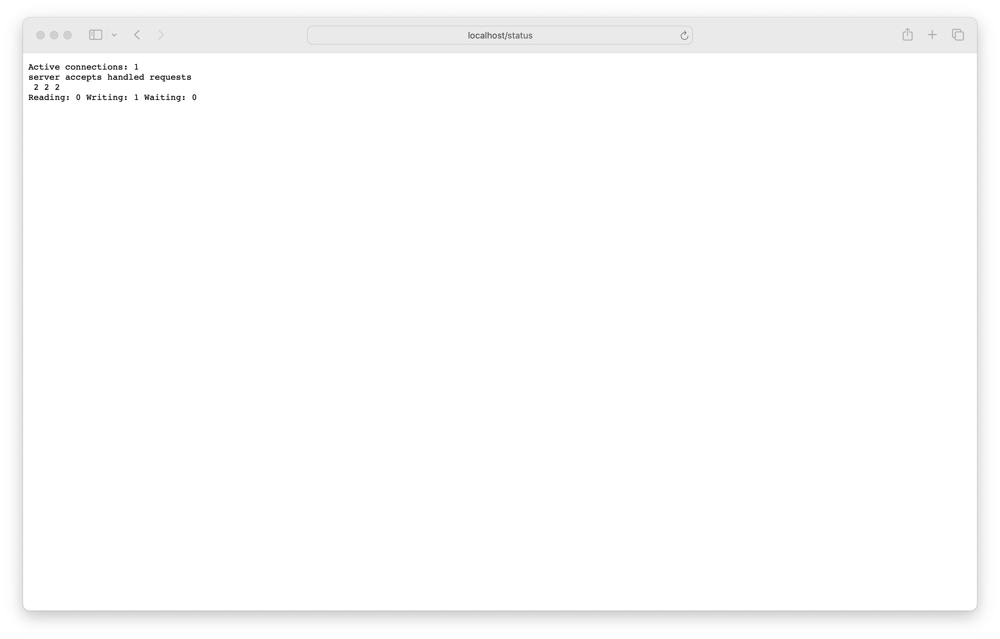

##### Экспортировать контейнер в файл *container.tar* через команду *export*

##### Остановить контейнер

##### Удалить образ через `docker rmi [image_id|repository]`, не удаляя перед этим контейнеры

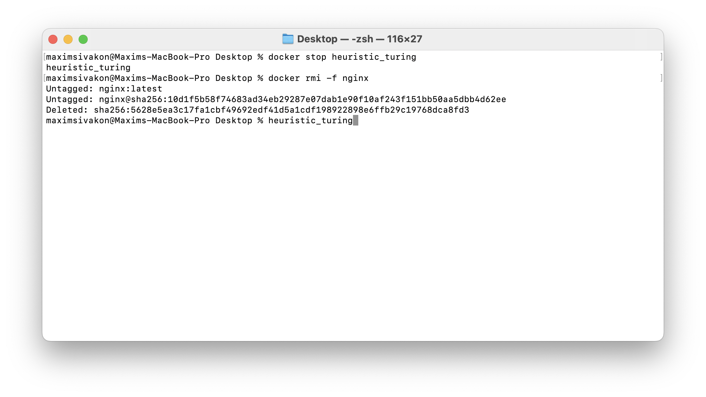

##### Удалить остановленный контейнер

##### Импортировать контейнер обратно через команду *import*

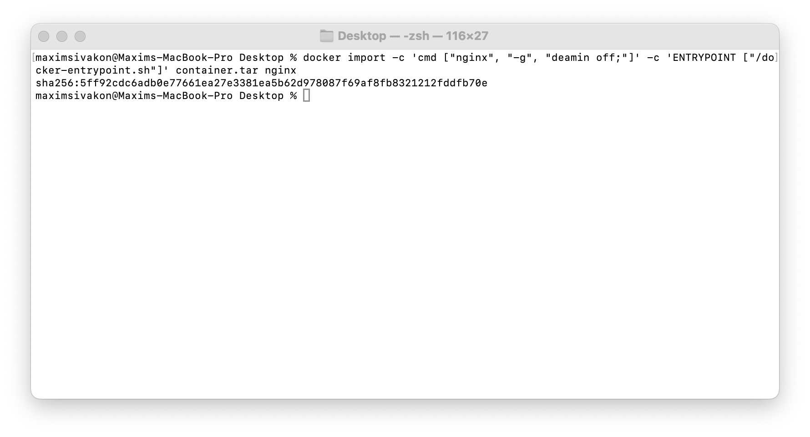

##### Запустить импортированный контейнер

##### Проверить, что по адресу *localhost:80/status* отдается страничка со статусом сервера **nginx**

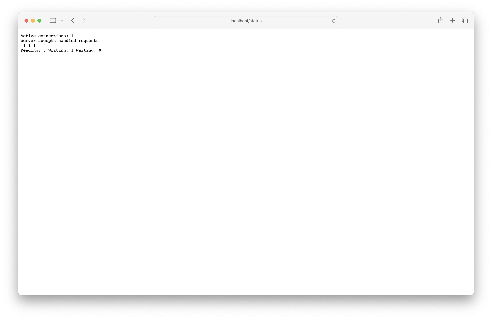

## Part 3. Мини веб-сервер

##### Написать мини сервер на **C** и **FastCgi**, который будет возвращать простейшую страничку с надписью `Hello World!`

##### Написать свой *nginx.conf*, который будет проксировать все запросы с 81 порта на *127.0.0.1:8080*
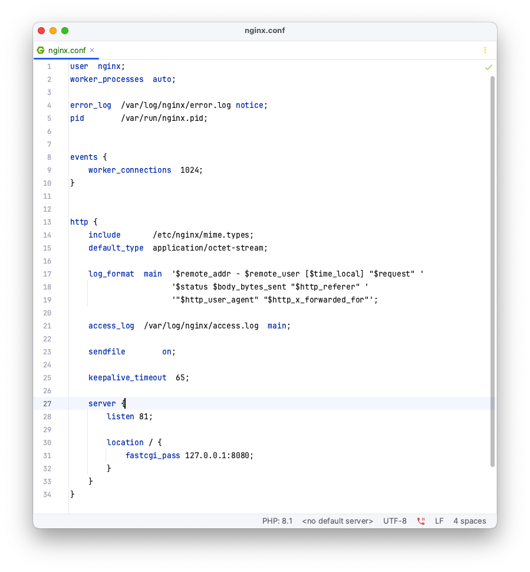

Запускаем контейнер
> docker run -d -p 81:81 nginx

Копируем в контейнер nginx.conf и main.c
> docker cp nginx/nginx.conf flamboyant_feynman:/etc/nginx

> docker cp main.c flamboyant_feynman:/home

Подсключаемся к консоли контейнера
> docker exec -it [image_id|repository] bash

Для выхода из консоли используем
> exit

Обновляем образ и устанавливаем gcc, spawn-fcig и libfcgi-dev
> apt-get update && install -y gcc spawn-fcgi libfcgi-dev

##### Запустить написанный мини сервер через *spawn-fcgi* на порту 8080

##### Проверить, что в браузере по *localhost:81* отдается написанная вами страничка
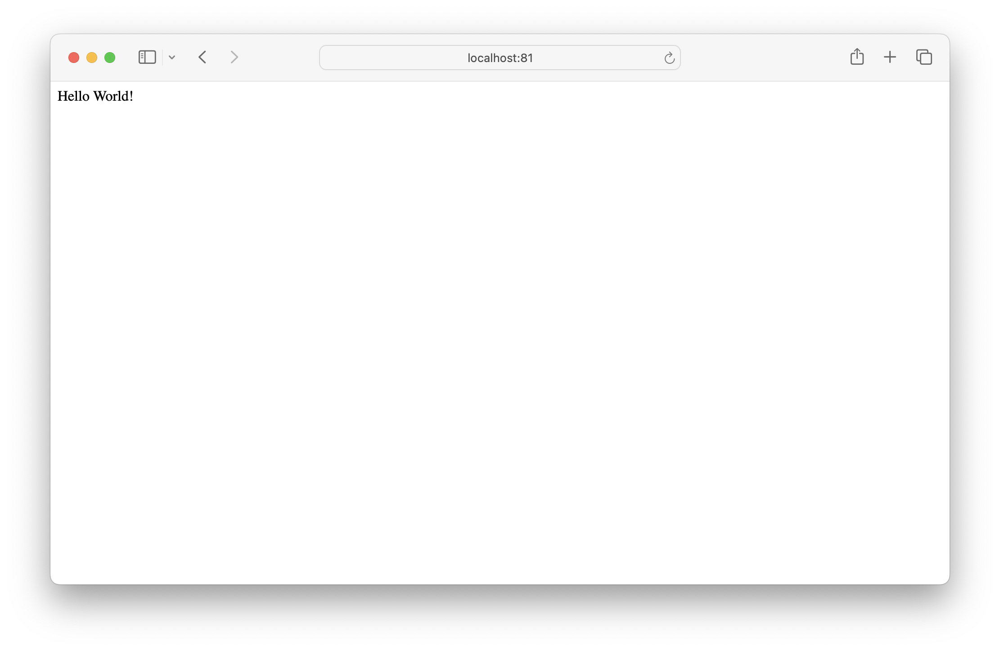

## Part 4. Свой докер

#### Написать свой докер образ, который:
##### 1) собирает исходники мини сервера на FastCgi из [Части 3](#part-3-мини-веб-сервер)
##### 2) запускает его на 8080 порту
##### 3) копирует внутрь образа написанный *./nginx/nginx.conf*
##### 4) запускает **nginx**.

Копируем в наш контейнер файлы

##### Собрать написанный докер образ через `docker build` при этом указав имя и тег

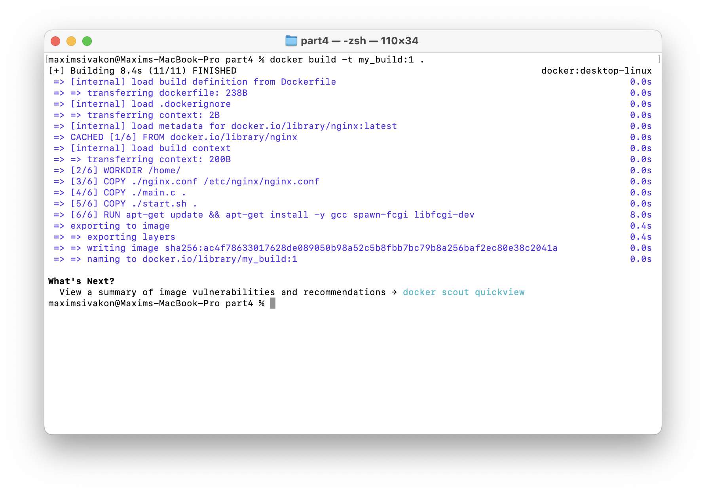

##### Проверить через `docker images`, что все собралось корректно

##### Запустить собранный докер образ с маппингом 81 порта на 80 на локальной машине и маппингом папки *./nginx* внутрь контейнера по адресу, где лежат конфигурационные файлы **nginx**'а (см. [Часть 2](#part-2-операции-с-контейнером))

##### Проверить, что по localhost:80 доступна страничка написанного мини сервера

##### Дописать в *./nginx/nginx.conf* проксирование странички */status*, по которой надо отдавать статус сервера **nginx**

##### Перезапустить докер образ

##### Проверить, что теперь по *localhost:80/status* отдается страничка со статусом **nginx**

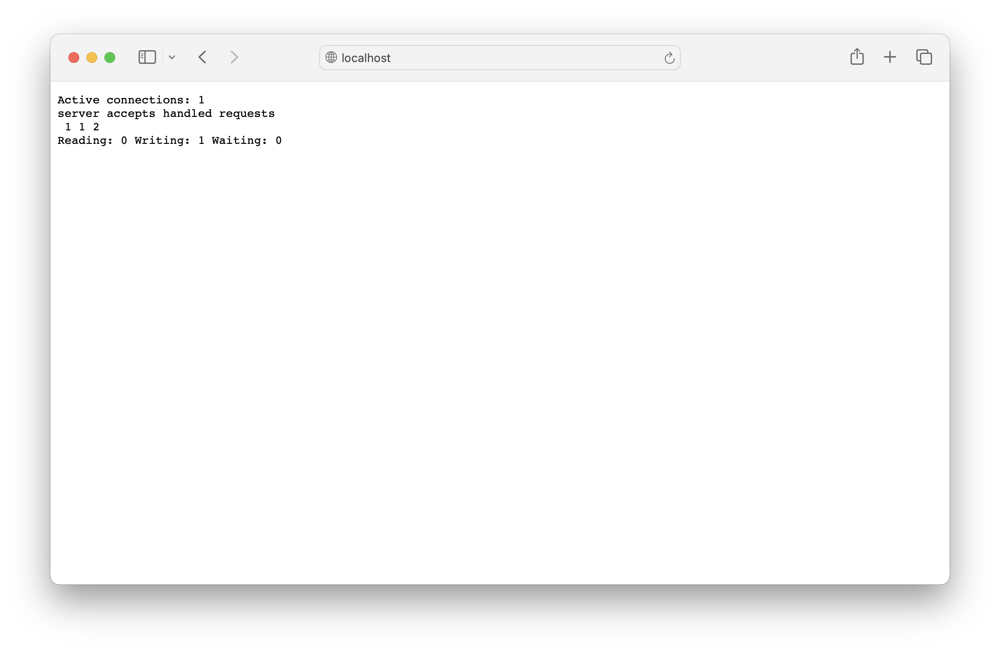

## Part 5. **Dockle**

##### Просканировать образ из предыдущего задания через `dockle [image_id|repository]`

Если нет dockle
> brew install goodwithtech/r/dockle

##### Исправить образ так, чтобы при проверке через **dockle** не было ошибок и предупреждений

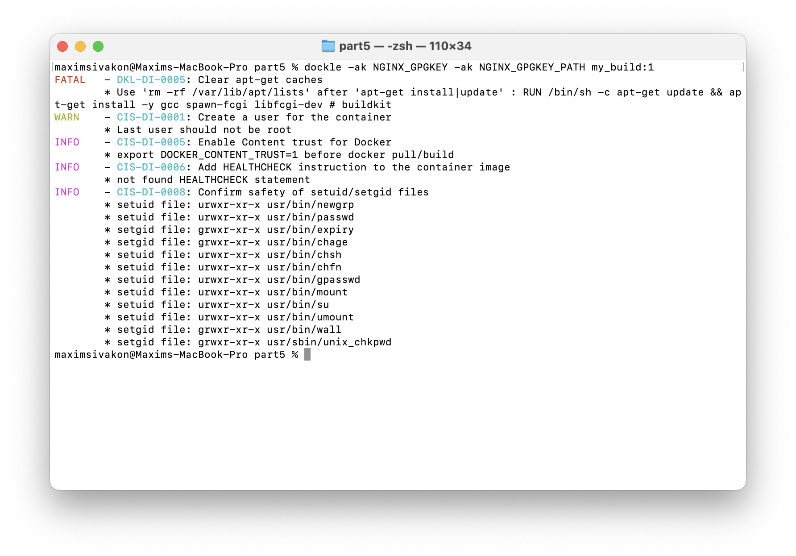

## Part 6. Базовый **Docker Compose**

##### Написать файл *docker-compose.yml*, с помощью которого:
##### 1) Поднять докер контейнер из [Части 5](#part-5-инструмент-dockle) _(он должен работать в локальной сети, т.е. не нужно использовать инструкцию **EXPOSE** и мапить порты на локальную машину)_
##### 2) Поднять докер контейнер с **nginx**, который будет проксировать все запросы с 8080 порта на 81 порт первого контейнера
##### Замапить 8080 порт второго контейнера на 80 порт локальной машины

##### Остановить все запущенные контейнеры

> docker stop [image_id|repository]

##### Собрать и запустить проект с помощью команд `docker-compose build` и `docker-compose up`

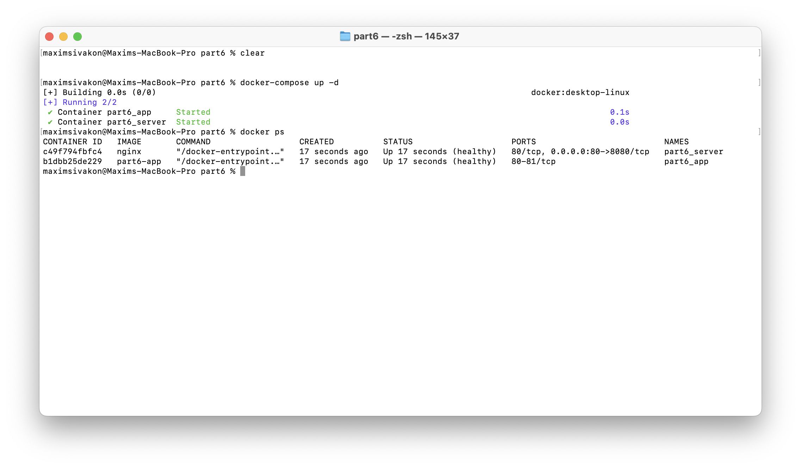

##### Проверить, что в браузере по *localhost:80* отдается написанная вами страничка, как и ранеe

